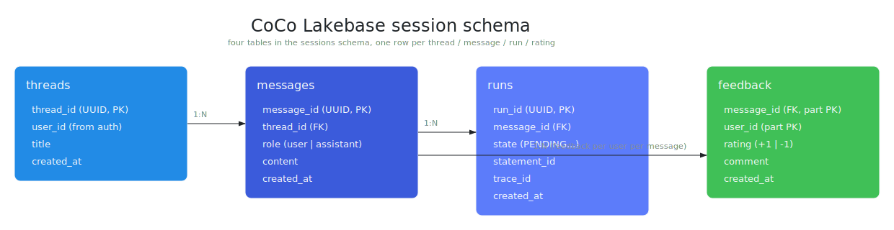
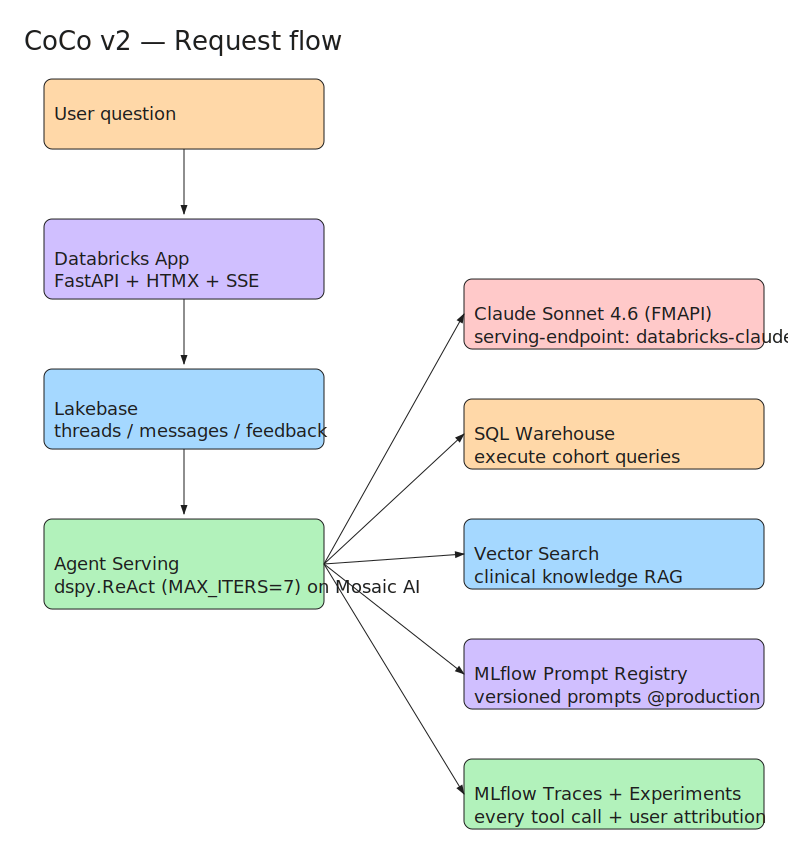

# CoCo v2 Architecture

CoCo v2 is a modular AI agent for healthcare RWD cohort queries. This document describes the system architecture, data flows, and design decisions.

For the evaluation and optimization loops specifically (how traces, feedback, and the weekly GEPA-based prompt tuning via `mlflow.genai.optimize_prompts` fit together), see [`docs/design/evaluation-architecture.md`](design/evaluation-architecture.md).

## System Components

### 1. Web App (FastAPI + HTMX)

**Purpose:** User-facing chat interface for cohort queries.

**Key modules:**
- `src/coco/app/main.py` - FastAPI app with SSE streaming
- `src/coco/app/routes/api.py` - POST /api/threads/*, /api/messages/*, /api/feedback
- `src/coco/app/routes/sse.py` - Server-sent events for real-time responses
- `src/coco/app/auth.py` - User authentication (X-User-ID header, SSO)

**Session persistence:**
- `src/coco/app/sessions/threads.py` - Thread CRUD
- `src/coco/app/sessions/messages.py` - Message CRUD
- `src/coco/app/sessions/runs.py` - Run state tracking
- `src/coco/app/sessions/lakebase.py` - Lakebase client + connection pooling

**Data model:**



Every row in every table carries `user_id` and every query filters on it, so one user's threads and feedback are invisible to another. See [`src/coco/app/sessions/`](../src/coco/app/sessions/) for the CRUD implementations.

### 2. CocoAgent (`dspy.ReAct` with native tool calling)

**Purpose:** The AI agent that answers cohort questions. Uses `dspy.ReAct` with native function calling - no separate planner prompt, no keyword matching, no terminal synthesize step.

**Location:** `src/coco/agent/responses_agent.py`

**How it works:**
1. `CocoAgent.__init__` configures a DSPy `LM` pointing at the FMAPI serving endpoint (`databricks-claude-sonnet-4-6`) and builds a `dspy.ReAct` module with the top-level `CohortQuerySignature` and 5 tool functions.
2. Each call to `predict_stream(messages)` refreshes the FMAPI Bearer token, opens a `react_agent` MLflow span, and calls `self.react(question=user_msg)`. `mlflow.dspy.autolog()` attaches an LM sub-span per ReAct iteration.
3. `dspy.ReAct` loops for up to `MAX_ITERS=7` iterations. Each iteration is one LLM call that either invokes one of the 5 tools or emits the final answer via the built-in `finish` action. The model IS the planner - no keyword matching.
4. The agent returns the final answer plus the full trajectory (step-by-step thoughts + observations), which the App renders as a collapsible `<details>` block under the assistant message.

**Tools (all decorated with `@mlflow.trace`):**
- `inspect_schema` - Lists tables/columns in the configured UC schema. Cached for the lifetime of the serving container.
- `identify_clinical_codes` - DSPy `ChainOfThought` over `ClinicalCodeSignature`; returns ICD-10 / NDC / CPT codes.
- `generate_sql` - DSPy `ChainOfThought` over `SQLGeneratorSignature`; returns Databricks SQL. Runs through the guardrails before returning.
- `execute_sql` - Calls the Statement Execution API through the configured warehouse. Read-only + schema-allowlist enforced by `guardrails.validate_sql_query`.
- `retrieve_knowledge` - Hybrid RAG over the `coco_knowledge_idx` Vector Search index (BM25 + BGE embedding).

**DSPy Signatures** (in `src/coco/agent/signatures.py`):
- `CohortQuerySignature` - top-level signature handed to `dspy.ReAct` (question -> answer).
- `ClinicalCodeSignature` - used by `identify_clinical_codes`.
- `SQLGeneratorSignature` - used by `generate_sql`.

Every signature is loaded with instructions from the MLflow Prompt Registry via `load_prompt(name).with_instructions(...)`; see `src/coco/agent/prompts/`.

### 3. Tool Implementations

#### ClinicalCodeIdentifier

**File:** `src/coco/agent/tools/clinical_codes.py`

**Inputs:**
- `query`: Natural language (e.g., "Type 2 diabetes with hypertension")
- `context`: Optional clinical domain knowledge

**Outputs:**
```python
ClinicalCodeResult(
    codes=[
        ClinicalCode(code="E11.9", type="ICD-10", confidence=0.95),
        ClinicalCode(code="I10", type="ICD-10", confidence=0.92),
    ]
)
```

**Implementation:** Calls Claude Sonnet via Gateway, parses JSON output.

**Confidence calibration:** Based on training data + GEPA prompt optimization (see 03_optimize_dspy.py, which uses `mlflow.genai.optimize_prompts` with `GepaPromptOptimizer`).

#### SQLGenerator

**File:** `src/coco/agent/tools/sql_generator.py`

**Inputs:**
- `user_query`: Original request
- `schema_context`: Available tables + columns
- `clinical_codes`: From ClinicalCodeIdentifier

**Outputs:**
```python
SQLGeneratorResult(
    sql="SELECT ... FROM diagnoses JOIN prescriptions WHERE code='E11.9'",
    rationale="Joined diagnoses and prescriptions to find...",
    valid=True
)
```

**Features:**
- Generates Databricks SQL (supports UNION, CTE, window functions)
- Includes schema aliases (p, d, rx)
- Validates against guardrails before execution

#### SQLExecutor

**File:** `src/coco/agent/tools/sql_executor.py`

**Inputs:**
- `sql`: SQL query
- `max_rows`: Max result rows to return

**Outputs:**
```python
SQLExecutorResult(
    statement_id="stmt-xxx",
    row_count=42,
    columns=["patient_id", "diagnosis_code"],
    sample_rows=[{...}, {...}],
    result_path="s3://..."
)
```

**Implementation:**
- Uses Databricks SQL Statement Execution API
- Async polling with backoff (PENDING -> RUNNING -> SUCCEEDED)
- Large results (>25 MB) returned as presigned URLs
- Arrow format for efficient serialization

#### KnowledgeRAG

**File:** `src/coco/agent/tools/knowledge_rag.py`

**Inputs:**
- `query`: Clinical concept (e.g., "metformin dosing")

**Outputs:**
```python
{
    "chunks": [
        {"id": "chunk_123", "text": "Metformin is ...", "score": 0.95},
        ...
    ]
}
```

**Implementation:**
- Hybrid search: BM25 (lexical) + embedding (semantic) with RRF ranking
- Searches Vector Search index built from clinical documentation
- Optional: included in agent's context for synthesis

### 4. Guardrails & Security

**File:** `src/coco/agent/guardrails.py`

**SQL Validation:**
1. **Read-only enforcement** - Rejects INSERT, UPDATE, DELETE, DROP, ALTER, CREATE
2. **Schema allowlist** - Only allows queries against `config.guardrails.allowed_schemas`, which defaults to `${COCO_CATALOG_NAME}.${COCO_SCHEMA_NAME}` (env-interpolated at deploy time so the allowlist always matches the actual UC catalog and schema the agent targets)
3. **Table extraction** - Parses SQL to identify referenced tables via sqlparse

**PHI/PII Protection:**
- App-level guardrails in `guardrails.py` (blocks SELECT of sensitive columns)
- Gateway-level filters on coco-llm route (blocks prompts containing SSN, medical record numbers, etc.)
- Feedback endpoint sanitizes user comments before logging

**Example:**
```python
validate_sql_query("SELECT * FROM users")
# (False, "Schema 'default.users' not in allowed list: ['coco_demo.cohort_builder']")
```

### 5. LLM Integration (Mosaic AI Gateway)

**Gateway Route:** `coco-llm`

**Configuration:**
```yaml
llm:
  endpoint: "databricks-claude-sonnet-4-6"
  gateway_route: "coco-llm"
  temperature: 0.0  # Deterministic
  max_tokens: 4096
```

**Client:** `src/coco/gateway/client.py`

**Features:**
- Rate limit handling (429) with Retry-After respect
- Usage context tags for cost tracking
- Streaming support (SSE) for real-time responses
- Timeout: 60 seconds per request

**Prompt Registry:**
Through MLflow Managed Prompt Registry with 3-part UC-qualified names, CoCo pins versions via the `@production` alias:
- `<catalog>.cohort_builder_<ns>.cohort_query` - top-level agent instructions
- `<catalog>.cohort_builder_<ns>.sql_generator` - SQL generation prompt
- `<catalog>.cohort_builder_<ns>.clinical_codes` - Code identifier prompt
- `<catalog>.cohort_builder_<ns>.response_synthesizer` - Response synthesis prompt

### 6. Session Persistence (Lakebase)

**Purpose:** Store threads, messages, and run history across app restarts.

**Configuration:**
```yaml
lakebase:
  instance: "coco-sessions"
  database: "coco"
  schema: "sessions"
  pool:
    min_conns: 1
    max_conns: 10
```

**Tables:**
- `threads` - User conversations
- `messages` - Chat history
- `runs` - Query execution state
- `feedback` - User ratings/comments

**User isolation:** All queries filtered by user_id (X-User-ID header).

### 7. Data Sources

#### RWD Tables (Synthetic)

Generated by `src/coco/data_generator/generator.py`:
- `patients` - 10k patients with demographics
- `diagnoses` - ICD-10 codes with dates
- `prescriptions` - NDC codes with dates
- `procedures` - CPT codes
- `claims` - Claims data
- `suppliers` - Manufacturer/pharmacy info

**Deterministic generation** (seed=42 by default) for reproducibility.

**Clinical correlations:**
- T2DM (E11.9) patients have metformin (high probability)
- Heart failure (I50) patients on ACE inhibitors
- Hypertension (I10) comorbid with diabetes

#### Knowledge Base (Vector Search)

**Index:** `coco_knowledge_idx`

**Source:** Clinical documentation (ICD-10 definitions, drug facts, guidelines)

**Embedding model:** `databricks-bge-large-en` (BGE, optimized for healthcare)

**Hybrid search:**
- BM25: Lexical match (drug name "metformin")
- Semantic: Embeddings (concept similarity)
- RRF: Reciprocal rank fusion to combine

### 8. Observability & Feedback

**MLflow Integration:**

```python
with mlflow.start_run(tags={"source": "coco-app"}):
    mlflow.log_param("query", user_input)
    mlflow.log_metric("sql_execution_time_ms", 150)
    mlflow.log_artifact("trace.json")
```

**Feedback Loop:**

Users can rate responses (thumbs up/down). Feedback is:
1. Logged to Lakebase `feedback` table
2. Exported to MLflow for analysis
3. Used to train/optimize DSPy signatures (03_optimize_dspy.py)

**Metrics:**
- Response latency (p50, p95, p99)
- Query success rate
- User satisfaction (thumbs up %)
- LLM token usage

### 9. Deployment (Databricks Asset Bundles)

**Configuration:** `databricks.yml`

**Resources:**
```yaml
resources:
  apps:
    coco_app:
      source_code_path: ./src/coco/app
      config:
        command: uvicorn coco.app.main:app
        env:
          COCO_CONFIG_PATH: config/default.yaml
          COCO_WAREHOUSE_ID: ${var.warehouse_id}

  jobs:
    setup_workspace: 
      notebook_task: notebooks/00_setup_workspace
    run_evaluation:
      notebook_task: notebooks/02_evaluate
      schedule: "0 2 * * 0"  # Weekly Sunday 2am
    optimize_dspy:
      notebook_task: notebooks/03_optimize_dspy
      schedule: "0 2 * * 0"  # Weekly Sunday 2am
```

**Targets:** demo, dev, staging, prod (production uses service principal).

## Data Flows

### User Query -> Response



The end-to-end path for a cohort question:

1. Browser POSTs the compose form to `/threads/{id}/send`. The App inserts the user message into Lakebase, returns an HTML fragment with both bubbles, and the assistant bubble's SSE extension opens a stream to `/threads/{id}/stream`.
2. The SSE handler loads thread history from Lakebase, invokes the Mosaic AI agent serving endpoint (SP auth, non-streaming), persists the answer, then chunks the answer out as `event: message` frames.
3. Inside the agent, `dspy.ReAct` runs for up to `MAX_ITERS=7` iterations. Each iteration is one LLM call. The model decides whether to call a tool (`inspect_schema`, `identify_clinical_codes`, `generate_sql`, `execute_sql`, `retrieve_knowledge`) or to emit the final answer via the built-in `finish` action.

### Feedback Loop


The feedback path:

1. User rates an assistant message (`POST /api/messages/{id}/feedback`). The row lands in Lakebase (`feedback` table, unique on `(message_id, user_id)`).
2. Notebook `03_optimize_dspy` runs weekly. It pulls the last 7 days of thumbs-up feedback from Lakebase, builds a `dspy.Example(question, answer)` set, and invokes `mlflow.genai.optimize_prompts` with `GepaPromptOptimizer` and a `Correctness` judge scoped to a held-out eval slice.
3. If the new prompt beats the current `@production` version by more than 2% on the eval, it's registered as a new version in the MLflow Prompt Registry and the `@production` alias is moved. The next serving invocation picks it up via `load_prompt("cohort_query")` - no redeploy.

## Configuration & Secrets

**Environment variables used:**
- `DATABRICKS_HOST` - Workspace URL
- `DATABRICKS_TOKEN` - Personal or service principal token
- `COCO_CONFIG_PATH` - Path to config file
- `COCO_WAREHOUSE_ID` - SQL Warehouse for queries

**Config file (default.yaml):**
- Database connections
- LLM settings
- Guardrails policies
- Data generator parameters
- Evaluation scenarios

**No hardcoded secrets** - all externalized.

## Performance Characteristics

| Operation | Latency | Notes |
|-----------|---------|-------|
| Clinical code ID | 2-5s | Claude Sonnet |
| SQL generation | 2-5s | Claude Sonnet |
| SQL execution | 1-30s | Depends on query complexity |
| Knowledge RAG | 1-3s | Vector search |
| Response synthesis | 2-4s | Claude Sonnet |
| **Total (typical)** | **8-47s** | 95th percentile |

**Optimization strategies:**
- Parallel tool calls (codes + knowledge lookup simultaneously)
- Streaming responses (show thinking while executing)
- Caching code identifiers (common queries)
- Short timeout on knowledge RAG (fail gracefully if slow)

## Scalability

**Current limits (tested):**
- **Patients:** 10,000 (synthetic data)
- **Queries/second:** 1-2 (depends on query complexity)
- **Concurrent users:** 2-4 (1-2 provisioned endpoint replicas)
- **Result size:** >25 MB handled via presigned URLs (no streaming)

**To scale:**
1. Increase warehouse cluster count (SQL execution)
2. Increase endpoint provisioned concurrency (LLM calls)
3. Enable scale-to-zero for cost efficiency during idle time
4. Implement prompt caching (repeated code identifications)

## Known Limitations

1. **Serialization format** - Currently JSON; switching to protobuf could improve latency
2. **Cold start** - First query takes 10-15s (JAR loading); subsequent queries 8-10s
3. **Timeout** - No graceful fallback if LLM times out; user sees error
4. **Negation handling** - Hard for LLM to parse "NOT metformin"; should use advanced prompting
5. **Temporal reasoning** - Date range queries need explicit guidance in prompts

## Future Improvements

1. **Prompt caching** - Cache commonly identified codes
2. **Function calling** - Use Claude's built-in tools instead of DSPy
3. **In-context learning** - Few-shot examples in prompts
4. **Graph databases** - Track patient journeys (temporal cohorts)
5. **HIPAA compliance verification** - Automated audit logging
6. **Multi-modal** - Support images (chest X-rays, lab plots)

---

See `README.md` for deployment and `docs/DEPLOYMENT.md` for infrastructure setup.
