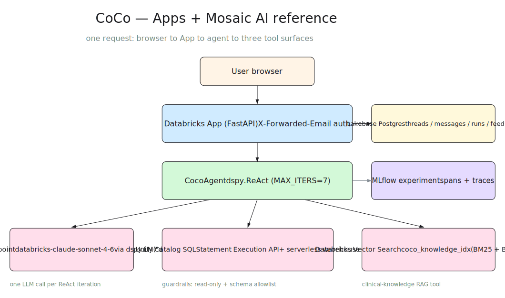

# Wiring a Mosaic AI Agent into a Databricks App with Lakebase Session State

**Status:** Draft
**Author:** [debu-sinha](https://github.com/debu-sinha) (debusinha2009@gmail.com)
**Last updated:** 2026-04-20

## Context

Databricks customers building user-facing AI applications increasingly want
to deploy a Mosaic AI agent behind a Databricks App, backed by Lakebase for
session persistence and Unity Catalog for the underlying data. On paper the
stack looks obvious:

- FastAPI front-end running on Databricks Apps
- Mosaic AI agent deployed as a Model Serving endpoint via
  `databricks.agents.deploy()`
- Lakebase (Postgres) for thread/message persistence
- Unity Catalog tables as the data the agent queries through a SQL warehouse

In practice, every piece of this stack has at least one undocumented
paper-cut that costs roughly a day of debugging per cut. This document
captures the pattern that actually works end-to-end on a Databricks workspace, the
specific failure modes that block the obvious paths, the concrete fixes,
and pointers to the reference code that implements each one.

It exists because there is no other writeup, internal or external, that
covers all of these pieces together. Every Solutions Architect helping a
customer assemble this stack in the next 12 months is going to walk into
the same landmines. This doc is the shortcut.

## Goals

- Give SAs a forkable reference they can hand a customer in the first week
  of an engagement
- Document each non-obvious failure mode with **Symptom**, **Root cause**,
  and **Fix**, so nobody has to rediscover them
- Produce concrete product feedback artifacts for the Apps, Lakebase, and
  Mosaic AI Agent Framework PM teams, one per rough edge
- Serve as the skeleton for a public blog post after internal review

## Non-Goals

- A production-grade chat UI. The reference uses plain HTMX + SSE, not a
  React / Next.js front-end. Teams that want a richer UI can swap it out
  without touching anything else in the stack.
- True token-level streaming from the agent. The Mosaic AI Agent Framework
  serving path emits MLflow-framed SSE, not plain OpenAI-style SSE. Gluing
  that to a browser `EventSource` is more effort than it's worth for a
  reference. This doc uses non-streaming agent invocation + chunked visual
  streaming at the UI layer.
- Enterprise auth, multi-tenant isolation, rate limiting, quotas, cost
  caps. Those belong in a companion document on cost instrumentation and
  governance.
- An evaluation setup. The agent emits MLflow traces, but how to
  score or regression-test those traces is out of scope here.

## Target audience

- Solutions Architects assembling a demo or reference implementation for a
  customer building an AI app
- Customer engineering teams adopting Databricks Apps + Mosaic AI for the
  first time
- Product managers on the Apps, Lakebase, and Mosaic AI Agent Framework
  teams who want a consolidated view of field rough edges

## Reference implementation

- Working repo: `coco-reference` (to be forked into a generic
  `databricks-solutions/apps-mosaic-ai-reference` after customer-specific
  material is stripped)
- Working deployment: `coco-cohort-copilot` Databricks App on `<your-workspace>`,
  calling the `coco-agent` Model Serving endpoint, persisting sessions to
  a `<your-lakebase-instance>` Lakebase instance
- Versions that matter: HTMX pinned to `1.9.12` (see gotcha 4.2),
  MLflow 3.x, `databricks-agents >= 1.1`, `psycopg[binary] >= 3.2`,
  `databricks-sdk >= 0.65`

## Architecture



The diagram source is `diagrams/apps-mosaic-ai-reference.excalidraw` - open in [excalidraw.com](https://excalidraw.com) to edit and re-export the SVG.

Request flow for a single cohort question:

1. User submits the compose form (`POST /threads/{id}/send` with
   `Content-Type: application/x-www-form-urlencoded`).
2. The App inserts the user message into Lakebase and returns an HTML
   fragment containing two bubbles: the user's message and an assistant
   placeholder whose inner content element opens an SSE connection to
   `/threads/{id}/stream`.
3. The SSE endpoint loads thread history from Lakebase, calls the agent
   serving endpoint non-streaming (`POST /serving-endpoints/<name>/invocations`
   with Responses API body shape), persists the final assistant message to
   Lakebase, then chunks the reply text out as `event: message` frames so
   the browser sees it land progressively. Emits `event: close` at the end
   so the HTMX SSE extension tears the connection down cleanly.
4. Inside the agent, `dspy.ReAct` runs with `max_iters=7`. Each iteration
   is one LLM call that either invokes one of five tools
   (`inspect_schema`, `identify_clinical_codes`, `generate_sql`,
   `execute_sql`, `retrieve_knowledge`) or emits the final answer via the
   built-in `finish` action. No separate keyword-matched planner, no
   separate synthesize prompt (see gotcha 3.1 for the migration).

## Gotchas

This is the load-bearing section. Each gotcha lists **Symptom**,
**Root cause**, **Fix**, and a **Reference** pointing at the file where
the fix lives in the coco-reference repo.

### Lakebase + Databricks Apps (the four horsemen)

These four all block the *exact same* line of code: opening a psycopg pool
inside the App container's startup hook. I burned four consecutive iteration
loops discovering each of these one at a time. Knowing all four
up front collapses roughly 90 minutes of deploy-fail-diagnose cycles into
one pass.

#### 1.1 There is no OBO scope for Lakebase

**Symptom:** You try to call `w.database.get_database_instance(...)` or
`w.database.generate_database_credential(...)` with the user's OBO token
forwarded via `x-forwarded-access-token`, and you hit
`PermissionDenied: unable to parse response` or `401`.

**Root cause:** `user_api_scopes` in a Databricks App spec has a fixed
allowlist: `sql`, `sql.statement-execution:*`, `dashboards.genie`,
`catalog.connections`, `catalog.tables:*`, `catalog.schemas:*`. There is no
`database:*` or `lakebase:*` scope, so the user OBO token the App receives
has no path to reach Lakebase even when the user themselves has permissions
on the instance. `iam.current-user:read` and `iam.access-control:read` are
auto-granted defaults and explicitly rejected as user-declared scopes.

**Fix:** Use the app's service principal, not OBO, for every Lakebase call.
The app SP credentials (`DATABRICKS_CLIENT_ID` / `DATABRICKS_CLIENT_SECRET`)
are auto-injected into the container. `WorkspaceClient()` with no args picks
them up. Record user identity in the Lakebase `user_id` column for
ownership filtering, not in the auth layer.

**Reference:** `src/coco/app/sessions/lakebase.py::_resolve_pgpassword`

**PM feedback:** File against the Databricks Apps team asking for either a
`database.lakebase:*` scope or first-class documentation that OBO is not
supported for Lakebase, to save future customers the investigation.

#### 1.2 PGPASSWORD is not injected - mint it at startup

**Symptom:** App boots, the `PG*` env vars are set except `PGPASSWORD`,
psycopg connection fails with `FATAL: password authentication failed`.

**Root cause:** When an App has an `AppResourceDatabase` resource binding,
Databricks Apps creates a Postgres role named after the app's SP client id,
grants it `CONNECT + CREATE` on the target database, and injects `PGHOST`,
`PGPORT`, `PGUSER`, `PGDATABASE`, `PGSSLMODE`, `PGAPPNAME` into the
container. It deliberately does **not** inject `PGPASSWORD` because the
password is a short-lived (~1h) OAuth credential that would be stale the
moment the container starts.

**Fix:** Mint the password on demand in the startup hook using the SP
credentials:

```python
from uuid import uuid4
from databricks.sdk import WorkspaceClient

def resolve_pgpassword() -> str:
    if os.environ.get("PGPASSWORD"):
        return os.environ["PGPASSWORD"]  # local dev override
    ws = WorkspaceClient()
    instance_name = os.environ.get("COCO_LAKEBASE_INSTANCE")
    if not instance_name:
        for inst in ws.database.list_database_instances():
            if getattr(inst, "read_write_dns", None) == os.environ["PGHOST"]:
                instance_name = inst.name
                break
    cred = ws.database.generate_database_credential(
        instance_names=[instance_name],
        request_id=str(uuid4()),
    )
    return cred.token
```

Set `COCO_LAKEBASE_INSTANCE` explicitly to skip the `list_database_instances`
scan and save one API call on cold start.

**Reference:** `src/coco/app/sessions/lakebase.py::_resolve_pgpassword`

**PM feedback:** File against Lakebase asking that the `AppResourceDatabase`
binding optionally inject a refreshed token at container start, plus
document the mint-on-demand requirement in the Apps + Lakebase guide.

#### 1.3 `CAN_CONNECT_AND_CREATE` does not grant CREATE on `public` schema

**Symptom:** After minting the password and opening the pool successfully,
the first `CREATE TABLE` during schema bootstrap fails with
`InsufficientPrivilege: permission denied for schema public`.

**Root cause:** `AppResourceDatabaseDatabasePermission.CAN_CONNECT_AND_CREATE`
grants `CONNECT` + `CREATE` on the *database*. In Postgres 15+, `CREATE`
on a database lets the grantee create *schemas* in that database, but
default `CREATE` on the `public` schema was revoked to `PUBLIC` in PG15.
So the app SP can create its own schema, but not create tables directly
under `public`.

**Fix:** Create an app-owned schema and put all session tables there.
Then pin `search_path` on every pooled connection so the existing query
helpers don't have to fully-qualify table names.

```sql
CREATE SCHEMA IF NOT EXISTS coco_app;
-- all session DDL goes under coco_app.*
```

Setting `search_path` via a `psycopg_pool.AsyncConnectionPool` `configure`
callback has its own problem (see 1.4). The working path is `libpq`'s
`PGOPTIONS` env var, which is read at connect time and applies to every
new connection in the pool:

```python
os.environ["PGOPTIONS"] = "-c search_path=coco_app,public"
```

**Reference:** `src/coco/app/sessions/schema.py`,
`src/coco/app/sessions/lakebase.py::connect`

**PM feedback:** File against Lakebase asking that the
`AppResourceDatabase` binding grant `USAGE + CREATE` on a named schema
owned by the app SP (e.g., `app_<short-name>`), plus document the PG15+
`public` gotcha prominently.

#### 1.5 Minted Lakebase token expires in ~1 hour but the pool lives forever

**Symptom:** The app starts cleanly, Lakebase comes up, queries work
for roughly an hour. Then every Lakebase query starts failing with
`PoolTimeout: couldn't get a connection after 10.00 sec` even though
`app.state.db` is still set and `/debug/env` still reports the pool
as initialized.

**Root cause:** `_resolve_pgpassword()` mints a Lakebase OAuth token
via `ws.database.generate_database_credential(...)` at pool open. The
documented TTL of that token is ~1 hour. The pool object itself has
no concept of credential expiry - it holds the connstr (with the
embedded password) forever. Once the token expires, libpq background
workers can't authenticate new connections, and `pool.connection()`
timeouts present as `PoolTimeout` rather than an auth error (the
pool's workers eat the real error and the caller sees only the
wait-for-checkout timeout). From the outside this looks exactly like
gotcha 1.4, but the fix is different: it's token lifecycle, not
error-surfacing.

**Fix:** Treat the password as a short-lived credential with its own
expiry independent of app uptime. Track an `expires_at` wall-clock
timestamp alongside the pool, gate every checkout through a
`get_pool()` helper that proactively rebuilds the pool when the token
is within a safety margin of expiry, and wrap queries in a one-retry
path that force-rebuilds on auth-like failures as a backstop:

```python
_TOKEN_TTL_S = 60 * 60
_TOKEN_SAFETY_MARGIN_S = 5 * 60

class LakebaseClient:
    def __init__(self, ...):
        ...
        self._expires_at: float = 0.0
        self._refresh_lock = asyncio.Lock()

    async def connect(self) -> None:
        ...
        await self.pool.open(wait=True, timeout=30.0)
        self._expires_at = time.time() + _TOKEN_TTL_S

    async def _force_rebuild(self) -> None:
        """Caller must hold self._refresh_lock."""
        if self.pool is not None:
            await self.pool.close()
        self.pool = None
        self._connstr = None  # next connect() re-mints
        self._expires_at = 0.0
        await self.connect()

    async def get_pool(self) -> AsyncConnectionPool:
        now = time.time()
        if self.pool is not None and now < self._expires_at - _TOKEN_SAFETY_MARGIN_S:
            return self.pool
        async with self._refresh_lock:
            now = time.time()
            if self.pool is not None and now < self._expires_at - _TOKEN_SAFETY_MARGIN_S:
                return self.pool
            logger.info(
                "Refreshing Lakebase DB token and recreating pool"
            )
            await self._force_rebuild()
            return self.pool  # type: ignore[return-value]

    async def _run(self, fn):
        pool = await self.get_pool()
        try:
            return await fn(pool)
        except Exception as e:
            if not _is_probable_auth_expiry(e):
                raise
            logger.warning(
                "Lakebase checkout failed with likely auth expiry; "
                "rebuilding pool and retrying once"
            )
            async with self._refresh_lock:
                await self._force_rebuild()
            return await fn(self.pool)
```

Every query helper then becomes a one-liner that closes over the
actual SQL and hands it to `_run`:

```python
async def execute(self, query, params=None):
    async def _inner(pool):
        async with pool.connection() as conn:
            result = await conn.execute(query, params)
            return await result.fetchall()
    return await self._run(_inner)
```

`_is_probable_auth_expiry` treats `psycopg_pool.PoolTimeout` as
likely-auth (because that's how auth failures surface through the
pool) plus any exception whose message contains `password` / `auth`
/ `expired` / `token`. It's a heuristic, not a perfect classifier -
the cost of a false positive is a single extra pool rebuild, the
cost of a false negative is "app silently broken again after 1h", so
we bias toward rebuilding.

**Log differentiation:** Use distinct log lines for the proactive
rotation path (`"Refreshing Lakebase DB token and recreating pool"`)
and the auth-failure fallback path (`"Lakebase checkout failed with
likely auth expiry. Rebuilding pool and retrying once"`) so future
debugging can tell "token expired" from "pool swallow" (gotcha 1.4)
from "database actually down" at a glance.

**Reference:** `src/coco/app/sessions/lakebase.py` - `get_pool`,
`_force_rebuild`, `_run`, `_is_probable_auth_expiry`.

**PM feedback:** File against Lakebase asking for a documented
`expires_in` field on the `generate_database_credential` response so
clients can track the real TTL rather than assuming ~1h. Also ask
for a Databricks-SDK helper that wraps `psycopg_pool` with this
rotation pattern built in, since every customer that hits this gotcha
has to reinvent it.

#### 1.4 `psycopg_pool.open()` silently swallows libpq errors

**Symptom:** `pool.open()` returns without error. The first
`pool.connection()` call then hangs for 10 seconds and raises
`PoolTimeout: couldn't get a connection after 10.00 sec`. No hint about
what actually went wrong.

**Root cause:** `AsyncConnectionPool.open()` with defaults returns as soon
as the background workers start. Background workers try to fill `min_size`
connections and will retry on failure, but they log errors to a logger the
app doesn't configure. The first user-facing call to `.connection()` then
times out waiting for a ready connection.

**Fix:** Pass `wait=True` and a generous timeout on `open()`. This forces
the real libpq connect error to surface as an exception instead of an
opaque PoolTimeout later:

```python
await pool.open(wait=True, timeout=30.0)
```

**Reference:** `src/coco/app/sessions/lakebase.py::connect`

**PM feedback:** Upstream the suggestion to the `psycopg_pool` maintainers
that `AsyncConnectionPool.__init__` should accept a `configure_on_open`
that raises rather than swallows. Lower-priority than the four Databricks
items above, but worth a note.

### Agent serving container grants

#### 2.1 Warehouse grants do not imply UC table grants

**Symptom:** The agent's `inspect_schema` tool returns an empty table list.
The LLM fills the gap by hallucinating about what's in the schema, often
referencing only tables it saw in the planning prompt (like the Vector
Search index). The user experience is the agent telling them the database
has no clinical data when in fact all the tables are populated.

**Root cause:** The Mosaic AI Agent Framework scopes the serving container's
auth from the `resources` list you pass to `mlflow.pyfunc.log_model`.
`DatabricksSQLWarehouse(...)` grants `CAN_USE` on the warehouse. It does
**not** grant `USE_CATALOG` or `USE_SCHEMA` on the schema the warehouse
queries, so `WorkspaceClient().tables.list(catalog_name=..., schema_name=...)`
silently returns an empty iterator.

**Fix (two-part):**

1. Declare every table the agent may read as a `DatabricksTable` resource
   in `deploy.py::_build_resources`:

   ```python
   from mlflow.models.resources import DatabricksTable
   for t in ("patients", "diagnoses", "prescriptions", "procedures",
             "claims", "suppliers"):
       resources.append(
           DatabricksTable(table_name=f"{catalog}.{schema}.{t}")
       )
   ```

2. Rewrite the schema inspector to query `system.information_schema.tables`
   and `system.information_schema.columns` via the warehouse rather than
   `client.tables.list()`. The warehouse grant covers this path and it
   keeps working even when table-level grants drift.

**Reference:** `src/coco/agent/deploy.py::_build_resources`,
`src/coco/agent/tools/schema_inspector.py`

**PM feedback:** File against Mosaic AI Agent Framework asking for a
`DatabricksSchema` resource type that grants `USE_SCHEMA + SELECT` on every
table in the schema, so we don't have to enumerate tables in the resources
list. Also file against docs asking them to highlight that `CAN_USE` on a
warehouse is insufficient for UC metadata reads.

#### 2.2 `code_paths` ships the entire codebase into the model artifact

**Symptom:** Every `log_model` uploads roughly 76 files for a project that
has maybe 10 Python modules the agent actually imports. Model artifact
balloons to include the FastAPI front-end, the data generator, raw
knowledge markdown docs, notebooks, and workshop scripts. Deploys take
longer than they should and the serving container has unrelated code on
its Python path.

**Root cause:** `deploy.py` originally passed `code_paths=[src/coco]`,
which causes MLflow to copy the entire `coco/` directory into the model
artifact. Everything under `coco/app/`, `coco/data_generator/`,
`coco/evaluation/`, and `coco/knowledge/*.md` gets bundled even though
the agent never imports any of it at inference time.

**Fix:** Stage a filtered copy of `src/coco/` to a tempdir before
`log_model` and point `code_paths` at the tempdir. Clean up in a `finally`.

```python
def _stage_runtime_code(src_coco_dir: str) -> str:
    tmp_root = tempfile.mkdtemp(prefix="coco-agent-code-")
    dst = os.path.join(tmp_root, "coco")
    EXCLUDED_TOP = {"app", "data_generator", "evaluation"}

    def _ignore(path, names):
        rel = os.path.relpath(path, src_coco_dir)
        drop = set()
        if rel == ".":
            drop.update(n for n in names if n in EXCLUDED_TOP)
        if rel.startswith("knowledge"):
            drop.update(n for n in names if n.endswith(".md"))
        drop.update(n for n in names if n == "__pycache__" or n.endswith(".pyc"))
        return drop

    shutil.copytree(src_coco_dir, dst, ignore=_ignore)
    return dst
```

Concrete result in the coco-reference deploy: **artifact file count dropped
from 76 to 43** between v4 and v5, a 43% reduction, with zero behavioral
change at inference time.

**Reference:** `src/coco/agent/deploy.py::_stage_runtime_code`

**PM feedback:** File against Mosaic AI Agent Framework asking for a
`code_paths_exclude` argument on `log_model` or first-class documentation
of this staging pattern. The current docs strongly imply you pass your
whole source tree, which makes sense for tiny projects but is a footgun
for any project that combines a front-end and an agent in the same repo.

### Agent behavior

#### 3.1 Why we replaced the keyword-matched planner with `dspy.ReAct`

**Historical symptom:** An earlier version of the agent used a
keyword-matched planner where `_plan_next_action` asked the LLM for a
tool name and string-matched the response against
`clinical_codes`, `knowledge`, `schema`, `sql`, `execute`. When the LLM
kept picking tool calls for ten iterations in a row, the loop exited
without ever reaching `action == "respond"`. No
`ResponsesAgentStreamEvent("assistant", ...)` was yielded, the entry
wrapper returned its fallback string `"(no response)"`, and simple
questions worked but anything that triggered tool selection failed.

**Structural fix:** The current agent uses `dspy.ReAct` with native
tool calling (`max_iters=7`). DSPy introspects each tool function's
signature and docstring to build the JSON-schema tool definitions the
LLM sees. The LLM returns structured tool-call blocks (not free-form
text the planner has to string-match), and the ReAct module's
built-in `finish` action produces the final answer. There is no
scenario where the loop exits without yielding an answer, because
`finish` is always available to the model and the trajectory carries
the answer.

```python
class CocoAgent:
    MAX_ITERS = 7

    def __init__(self) -> None:
        sig = CohortQuerySignature.with_instructions(load_prompt("cohort_query"))
        self.react = dspy.ReAct(
            sig,
            tools=[
                inspect_schema,
                execute_sql,
                identify_clinical_codes,
                generate_sql,
                retrieve_knowledge,
            ],
            max_iters=self.MAX_ITERS,
        )
```

**Reference:** `src/coco/agent/responses_agent.py::CocoAgent` and
`src/coco/agent/responses_agent.py::predict_stream`.

**Architectural note:** This is the same pattern Claude Code / MCP
uses - tool schemas out, structured tool-use blocks back, runtime
executes, model decides next step. No brittle keyword matching, no
terminal `_synthesize_response` call, no dead-end iteration paths.

### Streaming UI with HTMX + SSE

#### 4.1 Form POST -> user bubble + assistant SSE placeholder (the working pattern)

The working pattern for a chat send button:

1. Compose form has `hx-post="/threads/{id}/send"`,
   `hx-target="#message-list"`, `hx-swap="beforeend"`.
2. The POST handler accepts `content: str = Form(...)`, inserts the user
   message into Lakebase, and returns an HTML fragment containing:
   - A full user bubble
   - An assistant placeholder bubble whose inner content `<div>` has
     `hx-ext="sse"`, `sse-connect="/threads/{id}/stream"`,
     `sse-swap="message"`, `sse-close="close"`, `hx-swap="beforeend"`.
3. The browser's HTMX SSE extension opens the SSE connection as soon as
   the fragment lands in the DOM. On each `event: message` frame it
   appends the frame's `data:` payload into the content div. On
   `event: close` it tears the connection down instead of auto-reconnecting.

The reason this works where the original claude-desktop-generated template
did not:

- The original form was posting JSON to a FastAPI endpoint that expected
  a Pydantic `BaseModel`. Browsers post forms as
  `application/x-www-form-urlencoded` by default, so every submit was 422.
- The original template kept a *single* SSE connection open on page load
  that was supposed to run the agent on every new message, but there was
  no wire from the form submit to the SSE stream trigger.
- The original template used a broken nested `<template>` element inside
  an `hx-ext="sse"` div, which is not a valid HTMX SSE render pattern.

**Reference:** `src/coco/app/routes/pages.py::send_message`,
`src/coco/app/templates/_compose_response.html`,
`src/coco/app/routes/sse.py::_agent_sse_stream`

#### 4.2 HTMX 2.x split the SSE extension into a separate package

**Symptom:** `<script src="https://unpkg.com/htmx.org/dist/ext/sse.js">`
returns 404 when `htmx.org` resolves to the 2.x release.

**Root cause:** HTMX 2.x moved all extensions into separate packages
(`htmx-ext-sse`, `htmx-ext-json-enc`, etc.). The path
`htmx.org/dist/ext/sse.js` only exists in 1.x.

**Fix:** Pin HTMX 1.9.x explicitly until you have a reason to migrate:

```html
<script src="https://unpkg.com/[email protected]"></script>
<script src="https://unpkg.com/[email protected]/dist/ext/sse.js"></script>
```

**Reference:** `src/coco/app/templates/base.html`

#### 4.3 Mosaic AI Agent Framework SSE framing isn't plain OpenAI SSE

The MLflow Agent Framework serving path does emit SSE, but the frames are
not the OpenAI `data: {"choices": [{"delta": ...}]}` shape the browser's
`EventSource` (and the HTMX SSE extension) expects. Proxying them to the
browser requires per-frame format translation.

The reference sidesteps this entirely. The backend calls the agent
**non-streaming** (`ws.serving_endpoints.query` equivalent - see section5 for
the actual shape), gets the full assistant text, then **chunks the text
at the SSE layer** on the way out to the browser. The effect is a
streaming visual experience without any of the MLflow SSE parsing glue.

The user-perceived latency is the same as native streaming because the
agent call is the slow part (30-60s with tools), not the per-chunk
rendering.

**Reference:** `src/coco/app/routes/sse.py::_agent_sse_stream`,
`src/coco/app/agent_client.py::invoke`

### Model Serving invocation shape

#### 5.1 Responses API vs ChatCompletion API

**Symptom:** Calling the agent serving endpoint with
`{"messages": [{"role": "user", "content": "..."}]}` returns
`Failed to enforce schema of data`. Calling with
`serving_endpoints.query(name=..., messages=[ChatMessage(...)])` from the
SDK fails the same way.

**Root cause:** `ResponsesAgent` subclasses (what you get from
`databricks.agents.deploy()` on a ResponsesAgent) expect the Responses API
body shape:

```json
{"input": [{"role": "user", "content": "..."}]}
```

**not** the ChatCompletion shape with `messages`. The SDK's
`serving_endpoints.query(messages=[...])` builds a ChatCompletion payload
and the serving wrapper rejects it.

**Fix:** POST directly to `/serving-endpoints/<name>/invocations` with the
Responses API shape. Use `WorkspaceClient()` for auth and host resolution:

```python
ws = WorkspaceClient()
url = f"{ws.config.host.rstrip('/')}/serving-endpoints/{name}/invocations"
headers = {
    "Authorization": ws.config.authenticate()["Authorization"],
    "Content-Type": "application/json",
}
payload = {
    "input": [
        {"role": m.get("role") or "user", "content": str(m.get("content") or "")}
        for m in messages
    ]
}
```

**Reference:** `src/coco/app/agent_client.py::AgentClient._invoke_sync`

**PM feedback:** File against the Databricks SDK asking for
`serving_endpoints.query_responses(name=..., input=[...])` as a first-class
method, mirroring `query()` but for ResponsesAgent shape. Currently every
caller reinvents the raw HTTP path.

## Adoption plan

1. **Finish the reference implementation.** Land agent v6 (filtered
   `code_paths`, table grants, information_schema inspector, terminal
   synth fallback) and validate the cohort query path end-to-end on
   `coco-cohort-copilot`.
2. **Fork a clean reference repo.** Strip customer-specific
   workshop material out of coco-reference and push a generic
   `apps-mosaic-ai-reference` repo. Replace the Coco clinical schema with
   a neutral toy schema so the reference stands alone. Keep the app
   startup code, the agent entry wrapper, the deploy script, the SSE
   pattern, and this document.
3. **Internal SA playbook.** Publish this document in the SA Confluence
   space under the "field patterns" section. Link it from the Databricks
   Apps and Mosaic AI Agent Framework internal landing pages.
4. **PM feedback round.** File the tickets called out in each gotcha.
   Owner per area:
   - Databricks Apps: gotchas 1.1, 1.3, 2.2
   - Lakebase: gotchas 1.2, 1.3, 1.4
   - Mosaic AI Agent Framework: gotchas 2.1, 2.2, 3.1, 5.1
   - Databricks SDK: gotcha 5.1
5. **External blog.** After PM review, publish an edited version as a
   Databricks blog post or personal technical post, titled around the
   failure modes ("Seven things the Databricks Apps + Mosaic AI agent
   docs don't tell you" or similar).

## Open questions

- Is there an official Databricks recommendation for how to surface the
  mint-on-demand Lakebase password pattern? If not, should we upstream a
  helper into `databricks-sdk`?
- Does the Mosaic AI Agent Framework plan to ship a `DatabricksSchema`
  resource type? If yes, this doc's gotcha 2.1 fix becomes a simpler
  one-liner.
- Is there a roadmap for a streaming-native path out of the Agent Framework
  serving wrapper, so the chunked-at-the-UI-layer workaround in section4.3 can
  be replaced with real token streaming?
- Should the Databricks Apps runtime expose a `DATABRICKS_APP_SP_TOKEN`
  environment variable directly, so apps that need a short-lived token for
  non-Lakebase purposes don't have to construct a `WorkspaceClient` just
  to read `config.authenticate()["Authorization"]`?

## Risks

- **Shelf-life.** Every gotcha in this document is a product paper-cut.
  If the product teams fix them, sections of this doc become stale within
  weeks. That's a good problem. We should rev this doc quarterly and
  delete gotchas as the products absorb them.
- **Customer misapplication.** The reference is for *demonstration and
  starter implementation*, not production. The non-goals section says this
  explicitly but field users will skim. The repo README should repeat the
  warning prominently.
- **Coupling to HTMX 1.x.** The pinned HTMX version is a maintenance
  burden. Low severity because 1.9.x is still supported upstream, but
  worth a future refresh pass.

## Appendix: PM feedback ticket status

| Area | Gotcha | Ticket | Status |
|---|---|---|---|
| Databricks Apps | 1.1 No OBO scope for Lakebase | TODO | not filed |
| Databricks Apps | 2.2 code_paths bundling guidance | TODO | not filed |
| Lakebase | 1.2 PGPASSWORD mint-on-demand | TODO | not filed |
| Lakebase | 1.3 public schema + PG15+ | TODO | not filed |
| Lakebase | 1.4 pool.open() error swallowing | TODO | not filed |
| Mosaic AI Agent Framework | 2.1 DatabricksSchema resource | TODO | not filed |
| Mosaic AI Agent Framework | 3.1 Planner loop fallback | TODO | not filed |
| Mosaic AI Agent Framework | 5.1 Responses API in SDK | TODO | not filed |
| Databricks SDK | 5.1 query_responses method | TODO | not filed |

## Appendix: file pointers in the reference repo

| Concern | File |
|---|---|
| Lakebase pool + mint-on-demand password | `src/coco/app/sessions/lakebase.py` |
| Session schema (own-schema pattern) | `src/coco/app/sessions/schema.py` |
| FastAPI startup + lifespan | `src/coco/app/main.py` |
| SSE endpoint + chunked streaming | `src/coco/app/routes/sse.py` |
| POST /send + compose-response partial | `src/coco/app/routes/pages.py`, `src/coco/app/templates/_compose_response.html` |
| Agent entry wrapper (models-from-code) | `src/coco/agent/responses_agent_entry.py` |
| Agent planner + tool loop + terminal fallback | `src/coco/agent/responses_agent.py` |
| Schema inspector (information_schema path) | `src/coco/agent/tools/schema_inspector.py` |
| Filtered code_paths staging | `src/coco/agent/deploy.py::_stage_runtime_code` |
| UC table resources | `src/coco/agent/deploy.py::_build_resources` |
| Direct agent invocation (Responses API) | `src/coco/app/agent_client.py` |
| App compose form | `src/coco/app/templates/thread.html` |
