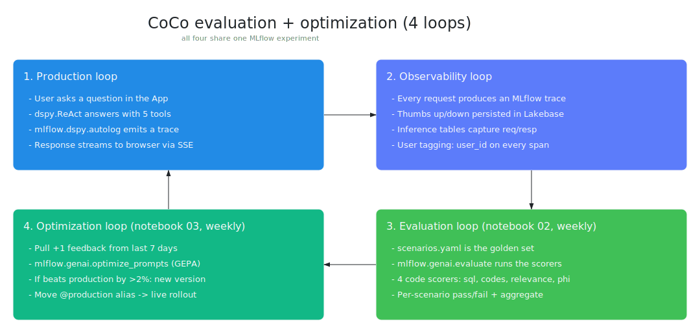

# CoCo evaluation and optimization architecture

A single reference for how agent responses are produced, observed, judged,
and used to improve the next response. Covers four loops that share the
same MLflow experiment as a substrate:

1. **Production loop** - user asks a question, agent answers.
2. **Observability loop** - every run emits a trace, every rating is a
   feedback record.
3. **Evaluation loop** - fixed golden-set runs scored by a mix of code
   scorers, built-in LLM judges, and custom judges.
4. **Optimization loop** - weekly GEPA pass (mlflow.genai.optimize_prompts) that turns positive
   feedback into a better prompt, published to the MLflow Prompt Registry
   so the production loop picks it up with no redeploy.

## Architecture

The diagram shows the four loops that share the MLflow experiment:
production → observability → evaluation → optimization. Source:
`diagrams/eval-architecture.excalidraw`. Open in
[excalidraw.com](https://excalidraw.com) to edit and re-export the SVG.

Today, the **evaluation loop** uses 4 code scorers in
`src/coco/observability/scorers.py` (`sql_validity`, `clinical_code_accuracy`,
`response_relevance`, `phi_leak`). The **custom judges via `make_judge()`**
and the **judge-builder alignment loop** are described below as planned
work; neither is wired into notebook 02 today.

## Component walkthrough

### 1. Production loop

- **App container** handles chat UI, persists threads/messages/feedback
  to Lakebase, and forwards cohort questions to the serving endpoint.
- **Serving endpoint** runs `CocoResponsesAgent` - a `dspy.ReAct` loop
  over five tools: `inspect_schema`, `identify_clinical_codes`,
  `generate_sql`, `execute_sql`, `search_knowledge`. On every request
  the agent calls `load_prompt("cohort_query")` which fetches the
  current production version from the MLflow Prompt Registry. A new
  prompt version is picked up on the next request with zero redeploy.
- **Warehouse** is the only place real cohort data is read, and every
  query passes `validate_sql_query` first (read-only + schema allowlist).

### 2. Observability loop

Three stores, all tied to the same MLflow experiment:

- **Traces** - `mlflow.dspy.autolog()` creates one trace per request
  containing every tool call, prompt, completion, latency, and token
  count. Used for debugging, sample for trace-based judges, and the
  input to Judge Builder's review experience.
- **Lakebase feedback** - thumbs up/down from the app. `UNIQUE
  (message_id, user_id)` + `ON CONFLICT DO UPDATE` means exactly one
  row per user per message, so the optimizer's training set never
  double-counts a rating.
- **Inference Tables** - serving endpoint's built-in request/response
  logging, written to `<catalog>.<schema>.coco_agent_*_payload`.
  Useful for scoring production traffic later (same
  `mlflow.genai.evaluate` API, `data=` points to the inference table
  instead of scenarios.yaml).

### 3. Evaluation loop (notebook 02)

Single API - `mlflow.genai.evaluate(data, predict_fn, scorers)`.

- `data` - list of `{inputs, expectations, ...extra_cols}` built from
  `evaluation/scenarios.yaml`.
- `predict_fn` - wraps `AgentClient.invoke` to call the live serving
  endpoint. Same wire format as any user request, so the eval sees
  exactly what a user would see.
- `scorers` - three classes coexist:

  | Scorer kind | API | Used for | Deterministic? |
  |---|---|---|---|
  | Code scorer | `@mlflow.evaluate.scorer` on a Python function | Anything with a hard rule: SQL parses, ICD-10 code matches expected, PHI regex hit | Yes |
  | Built-in judge | `Correctness()`, `Guidelines()`, `RelevanceToQuery()`, `Safety()` | Generic quality dimensions with zero setup - good starting scaffolding | LLM-based, stable |
  | Custom judge | `make_judge(name, instructions, ...)` (MLflow 3.4+) | Domain-specific criteria expressed in natural language - e.g. "Did the agent pick the right ICD-10 granularity for this cohort definition?" | LLM-based, requires alignment |

The eval run lands in MLflow with per-row scores, judge rationales,
aggregate metrics, and links back to each trace. Regression-detection
becomes "did this metric drop vs the last run?".

### 4. Judge alignment loop (Judge Builder)

Judge Builder is a Databricks Marketplace app on top of MLflow 3.4+.
It wraps three things that'd otherwise be four manual notebooks:

1. **Trace review UX** - a subject matter expert (SME) opens a
   sampled trace, sees the question, the agent's chain of thought and
   tool calls, and the final answer. They thumbs-up/down and can leave
   a short comment.
2. **Feedback store** - those expert labels land in MLflow as
   assessments on the trace.
3. **Judge alignment** - a background step takes the judge's natural
   language instructions plus the expert labels, runs an optimization
   so the judge's scores line up with the expert's scores, and emits a
   new aligned-judge version.
4. **Registry write** - the aligned judge gets saved as a prompt
   version in the Prompt Registry, so any evaluation run can load it
   by name.

The aligned judge then flows back into the evaluation loop (as the
`make_judge` object in the scorer list) AND the optimization loop (as
the metric GEPA maximizes), which is why the diagram has one dashed
arrow going to each.

Without Judge Builder, you can do the same thing manually:

- Collect traces and expert labels as MLflow assessments.
- Iterate on the `make_judge` instructions until judge-score matches
  expert-score on a held-out sample.
- Save the final judge as a prompt version.

Judge Builder just automates the iteration loop and gives SMEs a UI
that doesn't need them to write Python.

### 5. Optimization loop (notebook 03, weekly)

Scheduled Sunday 02:00 UTC, paused by default:

1. Pull thumbs-up feedback from Lakebase joined to messages to
   reconstruct `(question, answer)` pairs from the last 7 days.
2. Build `dspy.Example` training set, 80/20 split.
3. Configure DSPy LM to point at the same Claude endpoint the agent
   uses.
4. Evaluate the current production prompt on the validation set with
   `answer_quality_metric`. This should be the aligned judge from the
   Judge Builder loop, not a hand-coded metric.
5. `mlflow.genai.optimize_prompts(optimizer=GepaPromptOptimizer(...), scorers=[Correctness(...)])` searches over
   (instruction text, few-shot demo selection) and returns an
   optimized DSPy predictor.
6. Evaluate optimized on the same validation set.
7. If the delta is above 2%, `mlflow.genai.register_prompt(...)`
   writes the new instruction as a new version on the registry entry
   at `<catalog>.<schema>.cohort_query`. The agent picks it up on the
   next request.

Guardrails around this loop:

- Minimum 10 thumbs-up examples before it runs (configurable).
- 2% improvement floor before any prompt update.
- All runs land in the same MLflow experiment, so every prompt version
  has a lineage back to the eval run, the feedback window, the judge
  version, and the baseline it beat.

## Where CoCo sits today vs. the full picture

| Loop | Status | Gap |
|---|---|---|
| Production | Working | - |
| Observability - traces | Working (`mlflow.dspy.autolog()`) | - |
| Observability - feedback | Working (Lakebase, UNIQUE constraint) | - |
| Observability - Inference Tables | Enabled on endpoint, not yet queried | Wire into eval as a second `data=` source |
| Evaluation - code scorers | 4 scorers in `src/coco/observability/scorers.py` | Already wired into notebook 02 |
| Evaluation - built-in judges | Not yet used | Add `Correctness()` and `Guidelines(...)` to the scorer list in notebook 02 |
| Evaluation - custom judges via `make_judge` | Not yet used | Add one CoCo-specific judge: "Did the SQL return the right cohort size for this question?" |
| Judge alignment | Not yet used | Install Judge Builder from Marketplace, sample 20 traces, have an SME label them, align, register as a prompt |
| Optimization | Notebook 03 uses mlflow.genai.optimize_prompts + GepaPromptOptimizer with the built-in Correctness scorer | Swap the hand-rolled `answer_quality_metric` for the aligned custom judge once it's built |
| Prompt Registry | 3-part UC name format fixed | - |

## Minimum additions to close the gaps before external release

Small, bounded set of work, all in existing files:

1. **Add built-in judges to notebook 02** - one line each for
   `Correctness()` and `Guidelines(name="cohort_scope",
   guidelines="Use only the allowed UC schema. Never return PHI.")`.
2. **Add one custom judge via `make_judge`** in
   `src/coco/observability/scorers.py`. Natural language instructions
   only, no new dependencies.
3. **Wire the custom judge into notebook 03** as the `scorers=[...]`
   argument to `mlflow.genai.optimize_prompts`, replacing the built-in
   Correctness scorer currently used there.
4. **Document the Judge Builder flow** - a short README section
   telling a new deployer to install the app from the Marketplace,
   point it at this experiment, and sample N traces per week. No code
   change is needed for that. Judge Builder reads the existing
   experiment directly.

These four items complete the diagram. After them, CoCo uses exactly
the Databricks-recommended path and gives a domain expert three clean
levers that don't need any Python: thumbs-up the answer, edit a
judge's instructions in natural language, or edit the prompt template
in the registry UI.
